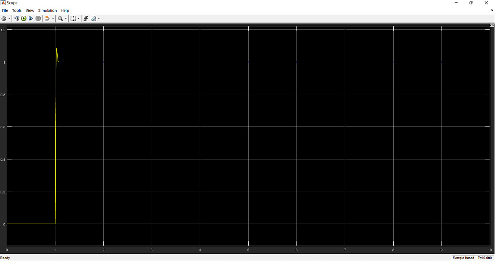

# Peltier Temperature Control System

This project shows the implementation of a closed loop temperature controller using a Peltier thermoelectric module. It includes hardware prototyping, system identification, PID tuning, Simulink modeling, digital control with Arduino, temperature sensing, LCD feedback and PWM based actuator control.

## Preview


The assembled system includes the Peltier cooling element, fan, motor driver, Arduino controller, LCD, temperature sensor, power supply and wiring within the experimental setup.


The controller structure connects the microcontroller, PWM output, Peltier device, cooled flow/cell, temperature sensor feedback, and PID correction path.


The schematic shows the Arduino-based circuit with the LCD, temperature sensor, push-button inputs, fan/Peltier driver path and supporting indicators.


The Simulink model represents the closed-loop PID controller around the identified plant model.



The PID response shows the controlled system achieving the target value with very small overshoot and less steady-state error than the pre-PID response.

## Main Features

* Peltier-based temperature-control system design
* Closed-loop feedback using a DS18B20 temperature sensor
* Arduino-based digital PID controller
* PWM actuation for the Peltier and fan components
* LCD output for current and required temperature
* Final Fritzing circuit-design file
* MATLAB PID tuning script
* Simulink plant-identification and system-identification models

## Technical Overview

The project begins with a thermoelectric Peltier cooling setup. The temperature sensor DS18B20 measures the controlled temperature and feeds it back to the controller. The Arduino calculates the control action and drives the actuator path using PWM. The system uses an LCD to display the measured and required temperatures.

System identification produced two candidate models:

$$G_1(s)=\frac{180.4s^2+11.48s+0.03416}{s^3+72.49s^2+4.596s+0.0193}$$

$$G_2(s)=\frac{98.99s+0.2997}{s^2+38.99s+0.1696}$$

The simpler second-order model was used for PID tuning:

$$G(s)=\frac{98.99s+0.2997}{s^2+38.99s+0.1696}$$

The digital controller is implemented in the final Arduino code using the reported controller gains. The controller output is converted into a PWM value for the hardware driver path.

## PID Performance Summary

The controller performance was reported as:

| Measure | Without PID | With PID |
|---|---:|---:|
| Rise time | 0.0165 s | 0.0105 s |
| Settling time | Not reported / unstable | 0.0447 s |
| Overshoot | 153.8246% | 6.2667% |
| Peak | 2.5382 | 1.0627 |
| Steady-state error | 0.0017 | 0 |

The PID controller reduced steady-state error and lowered overshoot compared with the pre-PID response.

## How to Run / Review

Open the Arduino controller sketch in Arduino IDE:

```text
arduino/PIDFULL4/PIDFULL4.ino
```

Open the MATLAB PID tuning script in MATLAB:

```text
matlab/PIDTuning.m
```

Open the Simulink models from:

```text
simulink/plant-identification/peltier-plant-identification.slx
simulink/system-identification/peltier-system-identification.slx
simulink/ds18b20-support/DS18B20.slx
```

Open the final circuit-design file in Fritzing:

```text
fritzing/peltier-temperature-control-system.fzz
```
The organized technical report is available at:

[Peltier Temperature Control System Report](https://drive.google.com/file/d/1nHYplwn8vRjBNS0EIc8F_VQeHuGvX10W/view?usp=sharing)

## Limitations

This is a simple control-systems project focused on PID temperature control, system identification, and Arduino-based hardware implementation. It is not intended to be a real-life temperature-control product.
