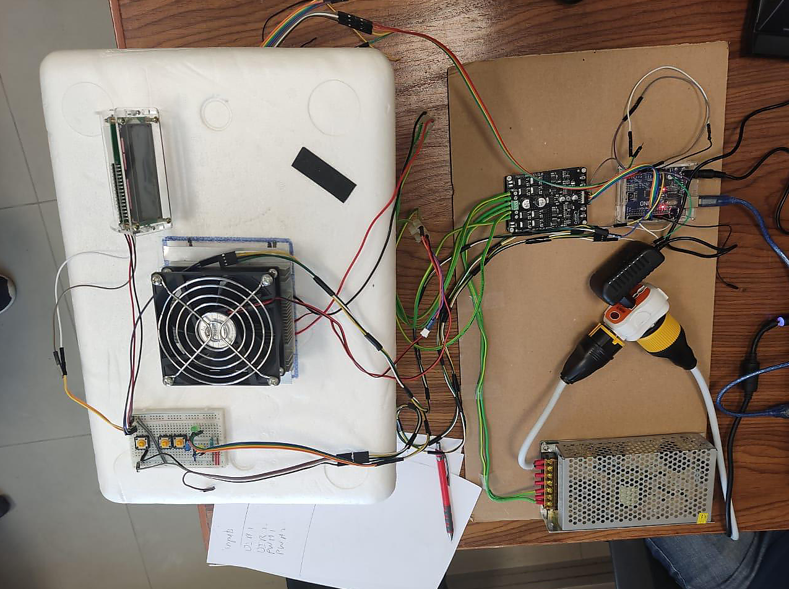
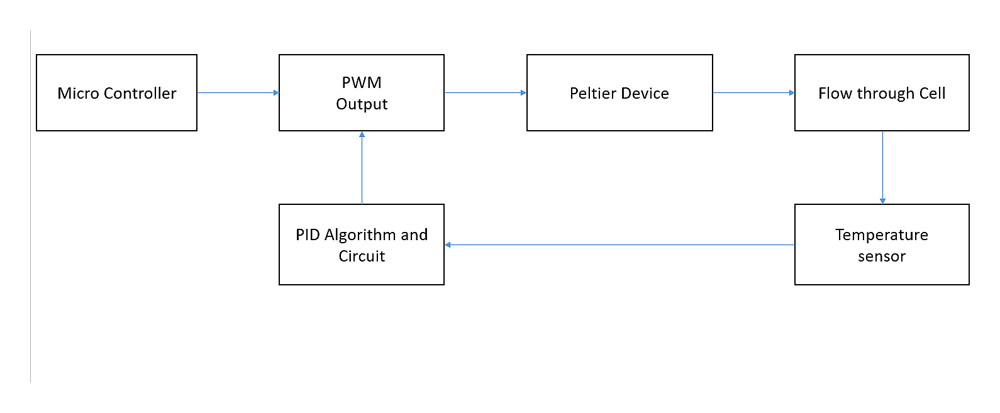
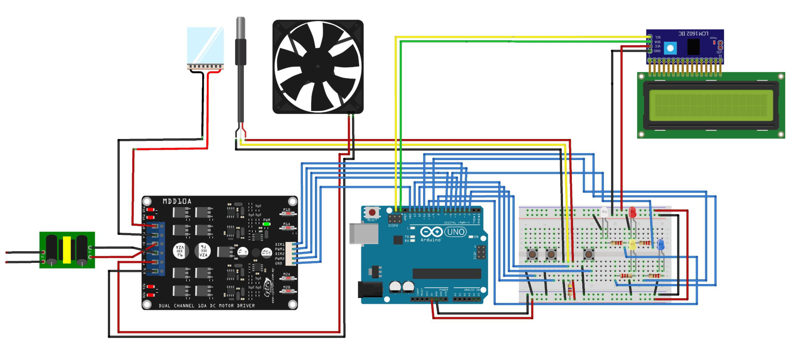
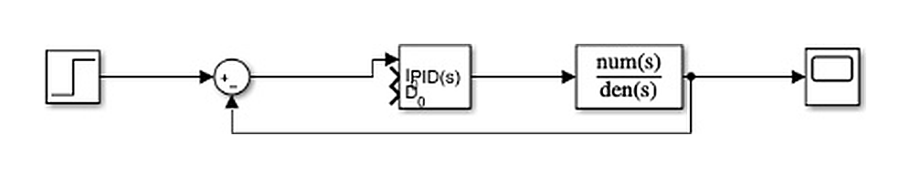

# Peltier Temperature Control System

This project documents a Control Systems implementation of a closed-loop temperature controller using a Peltier thermoelectric module. The system combines hardware prototyping, system identification, PID tuning, Simulink modeling, Arduino-based digital control, temperature sensing, LCD feedback, and PWM-based actuator control.

## Preview



The assembled system combines the Peltier cooling element, fan, motor driver, Arduino controller, LCD, temperature sensor, power supply, and wiring inside the experimental setup.



The controller structure connects the microcontroller, PWM output, Peltier device, cooled flow/cell, temperature sensor feedback, and PID correction path.



The schematic view shows the Arduino-based circuit with the LCD, temperature sensor, push-button inputs, fan/Peltier driver path, and supporting indicators.




The Simulink model represents the closed-loop PID controller around the identified plant model.


## Main Features

* Peltier-based temperature-control system design
* Closed-loop feedback using a DS18B20 temperature sensor
* Arduino-based digital PID controller
* PWM actuation for the Peltier/fan driver path
* LCD output for current and required temperature
* Final Fritzing circuit-design file
* MATLAB PID tuning script
* Simulink plant-identification and system-identification models
* DS18B20 Simulink/custom-block support files
* Technical report with names and invoice/cost material removed

## Technical Overview

The project starts with a thermoelectric Peltier cooling setup. The controlled temperature is measured using a DS18B20 temperature sensor and passed back to the controller. The Arduino computes the control action and drives the actuator path through PWM. The system uses an LCD to display the measured temperature and required temperature.

System identification produced two candidate models:

$$G_1(s)=\frac{180.4s^2+11.48s+0.03416}{s^3+72.49s^2+4.596s+0.0193}$$

$$G_2(s)=\frac{98.99s+0.2997}{s^2+38.99s+0.1696}$$

The simpler second-order model was used for PID tuning:

$$G(s)=\frac{98.99s+0.2997}{s^2+38.99s+0.1696}$$

The final Arduino code implements the digital controller using the reported controller gains and converts the controller output into a PWM value for the hardware driver path.


## PID Performance Summary

The controller performance was reported as:

| Measure | Without PID | With PID |
|---|---:|---:|
| Rise time | 0.0165 s | 0.0105 s |
| Settling time | Not reported / unstable | 0.0447 s |
| Overshoot | 153.8246% | 6.2667% |
| Peak | 2.5382 | 1.0627 |
| Steady-state error | 0.0017 | 0 |

The PID controller reduced steady-state error and lowered overshoot compared with the pre-PID response.

## Project Files

| Path | Purpose |
|---|---|
| `arduino/PIDFULL4/PIDFULL4.ino` | Final Arduino PID controller sketch. The folder name matches the sketch name for Arduino IDE compatibility. |
| `matlab/PIDTuning.m` | MATLAB PID tuning script for the identified plant models. |
| `simulink/plant-identification/peltier-plant-identification.slx` | Simulink model for plant-identification input/output collection. |
| `simulink/system-identification/peltier-system-identification.slx` | Simulink model used with the system-identification workflow. |
| `simulink/system-identification/identification-data/` | System-identification session/workspace files used with the identification model. |
| `simulink/ds18b20-support/` | DS18B20 Simulink/custom-block support model, wrapper files, and sensor libraries. |
| `fritzing/peltier-temperature-control-system.fzz` | Final Fritzing circuit-design file. |
| `docs/peltier-temperature-control-system-report.pdf` | Organized technical report. |
| `docs/peltier-temperature-control-system-report.tex` | LaTeX source for the organized technical report. |
| `public/images/projects/peltier-temperature-control-system/` | Project images used in the README and portfolio page. |

## How to Run / Review

Open the Arduino controller sketch in Arduino IDE:

```text
arduino/PIDFULL4/PIDFULL4.ino
```

Open the MATLAB PID tuning script in MATLAB:

```text
matlab/PIDTuning.m
```

Open the Simulink models from:

```text
simulink/plant-identification/peltier-plant-identification.slx
simulink/system-identification/peltier-system-identification.slx
simulink/ds18b20-support/DS18B20.slx
```

Open the final circuit-design file in Fritzing:

```text
fritzing/peltier-temperature-control-system.fzz
```

The organized technical report is available at:

```text
docs/peltier-temperature-control-system-report.pdf
```

## Limitations

This is a course-level control-systems project focused on PID temperature control, system identification, and Arduino-based hardware implementation. It is not intended to be a production-ready temperature-control product.
